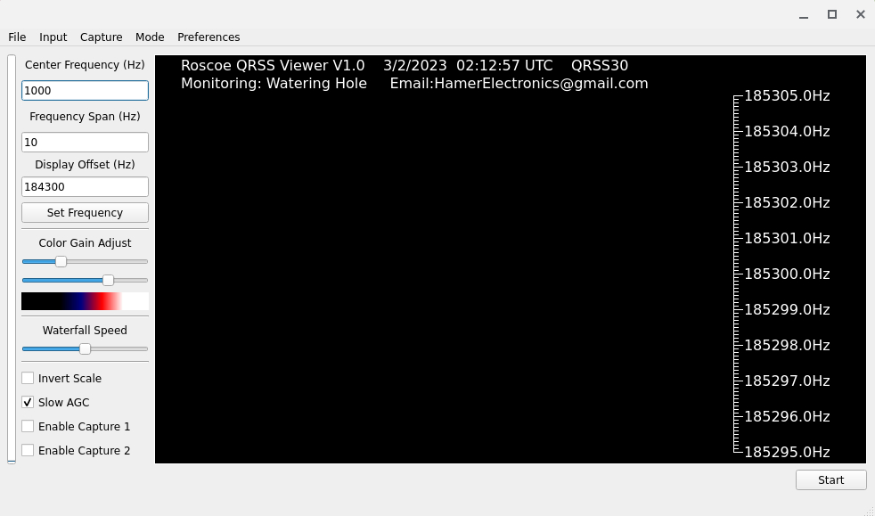

# RoscoeQRSSViewer
Roscoe QRSS Viewer
MIT License - See LICENSE.md
Copyright 2023 John Hamer

My name is John Hamer. I enjoy experimenting with low-frequency radio. I run the lowfer station JH in Conway SC FM03mw at frequency 181818Hz. For more information on LF stations in North America, visit www.lwca.org.

Roscoe QRSS Viewer is an open source python script to display a slow waterfall. The input is taken from the computers sound card. This script is similar to the popular program ARGO, but is not intended to be a replacement.

I write this script for my personal experiments, but made available as a base for other peoples experiments or as an alternative to available software that does not have cross platform support. 

Advantages:
1. Open source - Can be modified/customized
2. Cross platform - Not limited to windows

Disadvantages:
1. If using windows, requires windows 7 (I think)
2. CPU/memory hog compared to comparable software written in non-interpreted languages

Future plans:
1. EXTIO support for reading directly from SDRs
2. Notch filters to reduce local signals
3. Better AGC techniques
4. Overlapping over time to improve graphics or ELF experiments
5. Piggyback off FFT to show multiple frequency ranges

Requirements:
1. Python3.9 or later
2. Numpy
3. PyAudio
4. PySide2
